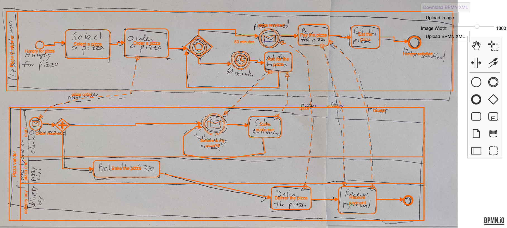

# BPMN Image Annotator




Annotation tool based on [bpmn-js](https://github.com/bpmn-io/bpmn-js) to annotate hand-drawn BPMN images with their ground-truth BPMN models.

Workflow:
1. Upload image
2. Model BPMN process over the image
3. Download BPMN XML

The XML will have an additional `backgroundSize` to track the width the image was rescaled to during modeling.
This way, the BPMN shapes and edges can be linked back to the position within the image.

`bpmn-js` enforces several correctness rules.
To allow the annotation of images that contain modeling errors, most of these rules have been disabled.
More details can be found in later sections.

## Installation


```
npm install
npm run dev
```

## Modeling Changes

- allow resizing elements
- allow elements outside of lane/pool (this can be achieved by shrinking lane after the element has been modeled)

## Rule Changes

Sequence Flow:
- (Message/Timer) End Event: allow outgoing sequence flow
- (Message/Timer) Start Event: allow incoming sequence flow

Message Flow:
- Event (all types): allow incoming+outgoing message flow
- Gateway (all types): allow incoming+outgoing message flow

Event-based Gateway:
- allow sequence flow to task

CallActivity:
- allow incoming/outgoing message flow

## TODO

- allow multiple event-based gateway sources for intermediateMessageReceiveEvent
- allow DataInputAssociation/DataOutputAssociation to catch/throwEvent
  - Status:
    1. updated canConnectDataAssociation(), but now I get exception `children is undefined` in `updateSemanticParent BpmnUpdater.js:594`
    2. updated BpmnUpdater, but it's not properly serialized:
    ```
      <intermediateThrowEvent id="Event_0l8nw9x" name="confirm order" dataOutputAssociations="[object Object]">
        <incoming>Flow_0liyhaz</incoming>
        <outgoing>Flow_00p472o</outgoing>
        <property id="Property_05xakg7" name="__targetRef_placeholder" />
        <dataInputAssociation id="DataInputAssociation_0fpc47y">
          <sourceRef>DataStoreReference_12vp77u</sourceRef>
          <targetRef>Property_05xakg7</targetRef>
        </dataInputAssociation>
        <messageEventDefinition id="MessageEventDefinition_1kd5ekt" />
      </intermediateThrowEvent>
    ```
    3.  dataInputAssociations/dataOutputAssocation is not allowed for CatchEvent/ThrowEvent in BPMN XML schema
      - I would have to change BPMN Moddle for that? https://github.com/bpmn-io/bpmn-moddle/blob/master/resources/bpmn/json/bpmn.json
- less hacky miminum lane dimension configuration: https://forum.bpmn.io/t/change-minimum-lane-dimensions/5318/2

## License

Apache 2.0

Also see the [bpmn-js](https://github.com/bpmn-io/bpmn-js) license.
